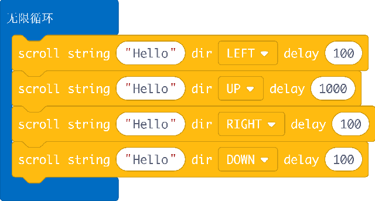
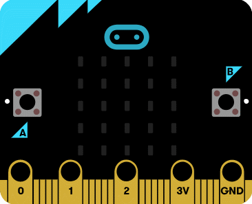
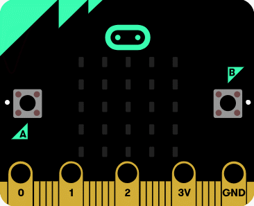

# ScrollText

makecode ScrollText package for micro:bit, it may show a scroll text in four direction with custom speed. 

Author: shaoziyang  
Date:   2018.Sept  

  
  
## Add extension

open your microbit makecode project, in Extension, paste  

https://github.com/makecode-extensions/ScrollText  

to search box then search.

## Basic usage

```
basic.forever(function () {
    ScrolText.showString("Hello", SCROLL_DIR.LEFT, 100)
    ScrolText.showString("Hello", SCROLL_DIR.UP, 100)
    ScrolText.showString("Hello", SCROLL_DIR.RIGHT, 100)
    ScrolText.showString("Hello", SCROLL_DIR.DOWN, 100)
})
```

## API

- **showString(s: string, dir: SCROLL_DIR, rotate: SCROLL_ROTATE, delay: number)**  
show a scroll string  
s: string
dir: scroll direction
rotate: display rotation  
delay: display speed

- **showNumber(n: number, dir: SCROLL_DIR, rotate: SCROLL_ROTATE, delay: number)**  
show a scroll number  
n: number
dir: scroll direction  
rotate: display rotation  
delay: display speed

## Demo

  

  

  

## License

MIT

Copyright (c) 2018, microbit/micropython Chinese community  

## Supported targets

* for PXT/microbit


[From microbit/micropython Chinese community](https://www.micropython.org.cn)
